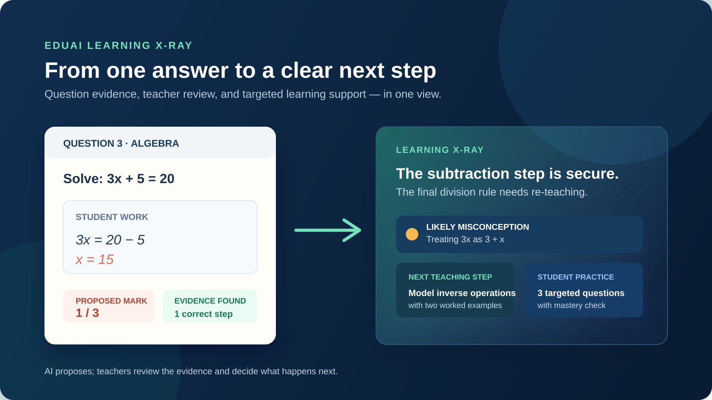
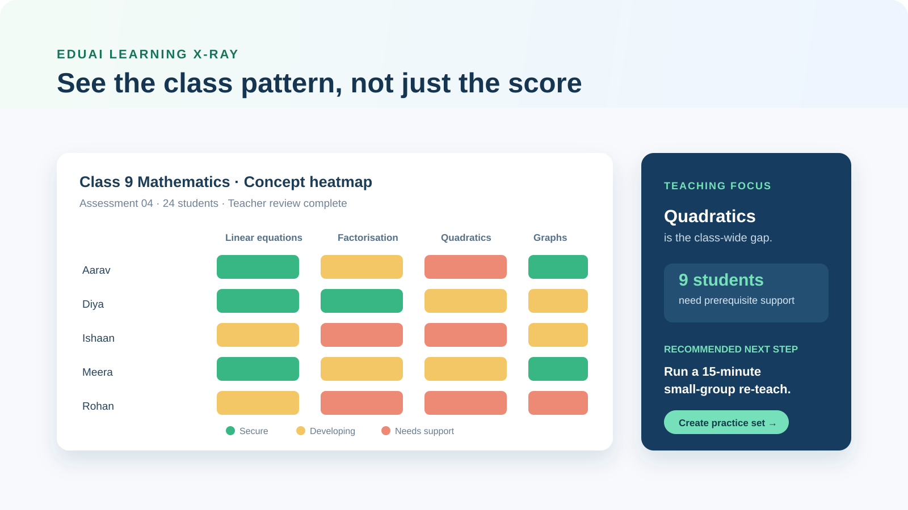

<div align="center">

# EduAI Learning X-Ray

### Turn assessment evidence into clear marks, meaningful learning gaps, and next-step teaching plans.

Learning X-Ray is an AI-assisted assessment workspace for educators. Upload a question paper and student answer sheet, then review question-wise marks, evidence-backed learning gaps, and personalised study resources before anything is finalised.

[**Open the live app**](https://eduai-learning-xray.accounts740459.chatgpt.site/) · [**Explore features**](#what-learning-x-ray-does) · [**Run locally**](#quick-start) · [**Architecture**](#project-structure)

   

<a href="https://eduai-learning-xray.accounts740459.chatgpt.site/">
  
</a>

</div>

---

## The assessment-to-action loop

| 1. Upload evidence | 2. Review marks | 3. Find gaps | 4. Take action |
| --- | --- | --- | --- |
| Add question papers, answer sheets, marking schemes, and model answers. | Inspect every question, the evidence used, and the proposed score. | Surface only evidence-supported misunderstandings and partial knowledge. | Generate study guides, practice resources, marksheets, and shareable reports. |

## What Learning X-Ray does

### Assessment grading that respects the paper

- Uses the uploaded question paper as the source of truth for the paper total and per-question maximum marks.
- Reconciles OCR and AI question labels with the printed question order, including variations such as `Q1(a)`, `1a`, and section-prefixed labels.
- Keeps the complete assessment total intact even when only some printed marks are directly recoverable from OCR.
- Supports quarter-mark, half-mark, and whole-mark scoring where applicable.
- Requires a teacher to review and approve proposed results before they are treated as final.

### Evidence-backed learning analysis

- Identifies incorrect, partially correct, incomplete, and unanswered work.
- Connects every learning gap to question-level evidence, a likely misconception, prerequisites, and a concrete rework sequence.
- Separates genuine conceptual gaps from presentation feedback, so strong students are not given unnecessary remediation.
- Creates parent-ready summaries that focus on what a student needs next.



### Resources built from the result

- Personalised study guides with explanations, worked examples, guided practice, and mastery checks.
- Targeted worksheets and assessments for identified concepts.
- Downloadable learning-gap reports, study guides, marksheets, and class-level summaries.
- Flowcharts and mind maps to support visual learning.
- Secure share links for student and parent-facing dashboards.



### Built for the educator workflow

- Secure sign-in and role-aware workspace access.
- Student profiles, assessment management, credits, and teacher review states.
- OCR, grading, resource generation, and report export in one workspace.
- Admin user and invitation management.

## A note on marks accuracy

The question paper is not optional context: it is the assessment authority. Learning X-Ray checks that the question-wise maxima add up to the paper total and prevents a partial OCR extraction from silently shrinking the score. For example, a 20-mark paper remains a 20-mark paper even if only some margin marks are readable by OCR.

AI marks are always proposals. The app exposes question-level evidence and review controls so a teacher can confirm or adjust each decision before submission.

## Quick start

### Prerequisites

- Node.js `>= 22.13.0`
- A Supabase project
- API keys for the configured OCR and learning-analysis providers

### Install and run

```bash
git clone https://github.com/prag-ai-hub/EduAI-Learning-XRay.git
cd EduAI-Learning-XRay
npm install
```

Create a local environment file from the example:

```bash
copy .env.example .env.local
```

On macOS or Linux:

```bash
cp .env.example .env.local
```

Configure the required values:

```env
MISTRAL_API_KEY=
OPENAI_API_KEY=
SUPABASE_URL=https://YOUR_PROJECT_REF.supabase.co
SUPABASE_SECRET_KEY=
```

Start the development server:

```bash
npm run dev
```

Open the local URL printed in the terminal.

## Useful commands

| Command | Purpose |
| --- | --- |
| `npm run dev` | Start local development. |
| `npm run build` | Create and verify the production build. |
| `npm test` | Build and run the rendered HTML test suite. |
| `npm run lint` | Run ESLint across the project. |
| `npm run db:push` | Push the configured Supabase database schema. |

## Project structure

```text
app/
├── api/                     # OCR, grading, reporting, resources, sharing, and workspace APIs
├── app/                     # Authenticated educator workspace
├── share/[token]/           # Parent and student share view
├── ui/                      # Product UI, grading review, reports, and marketing components
├── page.tsx                 # Public landing page
└── chatgpt-auth.ts          # Sign in with ChatGPT helpers

lib/
├── evaluator-grading.ts     # Question-level grading validation
├── question-marks.ts        # Printed-mark extraction and paper-total reconciliation
├── document-text.ts         # Document text handling
├── supabase-auth.ts         # User authentication helpers
└── supabase-server.ts       # Server-side Supabase client

public/
└── brand/                   # Learning X-Ray brand assets

tests/                       # Functional, grading, PDF, and rendered HTML checks
```

## Technology

| Layer | Technology |
| --- | --- |
| Application | Next.js 16, React 19, TypeScript |
| Styling | Tailwind CSS and product-specific CSS |
| Data and authentication | Supabase |
| OCR and analysis | Mistral and OpenAI APIs |
| Documents and exports | jsPDF, html2canvas, SheetJS (`xlsx`) |
| Hosting | OpenAI Sites on Cloudflare Workers |
| Validation | Node test runner, ESLint, Vinext build |

## Responsible use

Learning X-Ray supports teacher judgement; it does not replace it. Treat generated grades, feedback, and study plans as reviewable recommendations. Confirm marks against the paper and answer evidence before communicating results to students or families.

## Contributing

Contributions and issue reports are welcome. For substantial changes, please open an issue first so the proposed behaviour, grading implications, and teacher-review flow can be discussed before implementation.

---

<div align="center">

Built for clearer assessment decisions and more actionable learning support.

</div>
